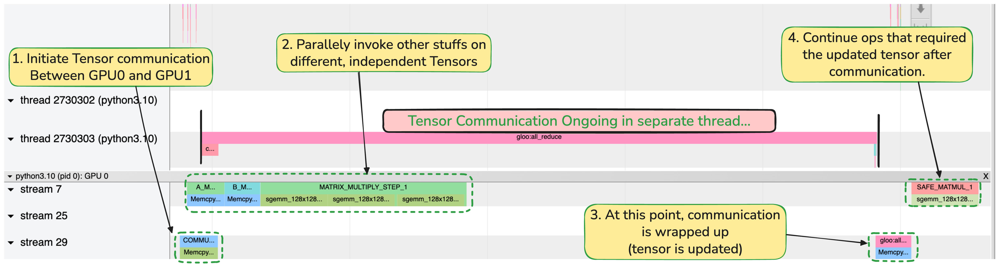

### How to Overlap Communication and Computation in PyTorch 

**Communication** primarily involves data transfers between CPU and GPU, GPU to GPU within the same machine, or across different machines.

**Computation** primarily involves operations like matrix multiplication that execute on GPU cores.

Since different hardware components handle these operations (DMA controllers handle data transfers while GPU cores handle computation), we can overlap these operations to maximize throughput.

### Environment
This program was tested on a single node with two GPUs connected via PCIe bus.

### Understanding the Program with Torch Profiler Visualizations
The program launches two separate PyTorch processes, each utilizing one GPU. Each process initializes a `comm_tensor` that needs to be updated with the sum of `comm_tensor` values from both processes using the `all_reduce` collective operation.

The profiler visualization shows execution for one process (e.g., process 0 on GPU0). The `all_reduce` operation involves two data transfers:
 
- **Figure Step 1:** Data transfer from GPU0 memory to system memory
  - Meanwhile, process 1 initiates transfer of its comm_tensor from GPU1 to host memory
  - A separate thread on the CPU performs the sum operation
- **Figure Step 3:** The summed data is transferred from system memory back to GPU0 memory (all-gather phase)
  - The same process occurs for process 1 and GPU1

We don't concern with implementation detail of communication, but the fact that, while **Step 1** communication happens (GPU to CPU transfer), **Step 2** Data Transfer from CPU-GPU run in parallel. The matrix multiplication completes while the process waits for the updated `comm_tensor` from the host before final `matmul` Operation.

### Generating Profiling Results :  
`torchrun --nproc_per_node=2 overlap_comm_compute.py`

The output trace will be saved in the `./profiler_logs` directory. You can load this trace in Chrome by navigating to `chrome://tracing`.

### Possible Performance Enchancements :
- Consider NUMA Affinity : https://github.com/pytorch/pytorch/issues/115305 