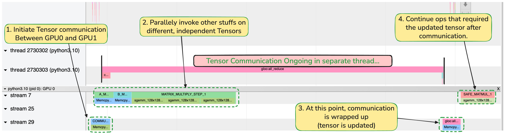

### How to to Overlap Communication and Computation in PyTorch 

Communication Mostly entails :: Data transfers between CPU and GPU, GPU to GPU e.t.c within same machine or across different machines. 
Computation Mostly entails :: Operations like matrix multiplication.

Since different set of hardwares exist to take care of this, ..   DMA takes care of first one, while computations happen done in GPU cores. 
Hence, we can overlap these two operations.

### Environment this program was tested on 
Single node with two gpus. These GPUS connected with PCIE Bus.

### Understanding the the program with visualizations from torch Profiler 
The Program below launches two separate pytorch processes, each utilizing one of the GPUS of the system. 
Each process initializes `comm_tensor`. We want to update `comm_tensor` in each process, as sum of `comm_tensor` of two. 
For this, have an an `all_reduce` promitive ? collection ? available. 

Prolifer Visualization below is for one of the process (say process 0 is attached to GPU0). We can see the `all_reduce` doing two data transfers  : 
- ( Figure Step 1  ) Data transfer from GPU0 Memory to System-Memory
  ( Meanwhile, process 2 would initiate Data transfer of it's comm_tensor from GPU1 System memory to Host-memory. A separate Thread sums tensors up in CPU side )    
- (Figure Step 3 ) This Summed Data is transferred from System-Memory to GPU0 Memory (all-gather)
- This same thing would be happening for ( process1, GPU1 ).

Thing of concern is not the implementation detail of communication, but that fact that, while step 1 of this communication happens (GPU to CPU transfer), Data Transfer from CPU-GPU run in parallel (Figure Step 2 ). As process is still waiting on getting updated `comm_tensor` back from Host, the matrix multiplication has also finished in GPU.

### Generating Profiling Results :  
`torchrun --nproc_per_node=2 overlap_comm_compute.py`

The output trace will be saved in the `./logs` directory, which you can load in your chromium browser at `chrome://tracing` 

### Possible Performance Enchancements :
Consider NUMA Affinity ( https://github.com/pytorch/pytorch/issues/115305 ). 