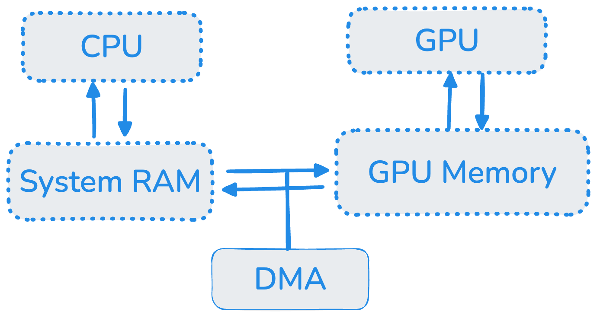
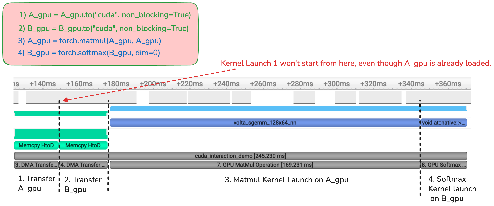
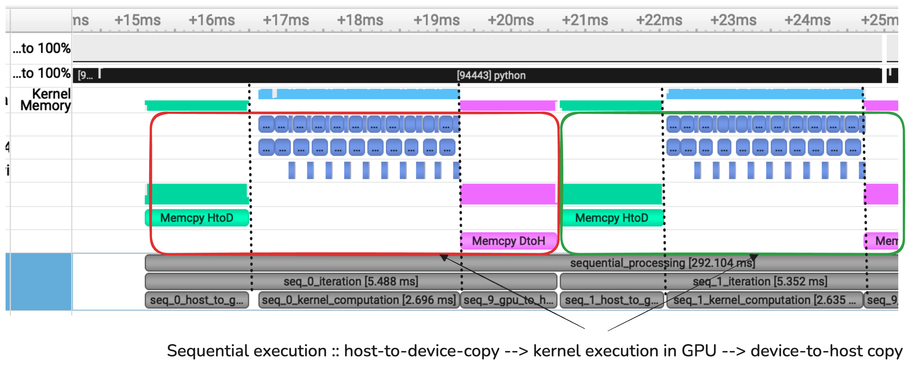
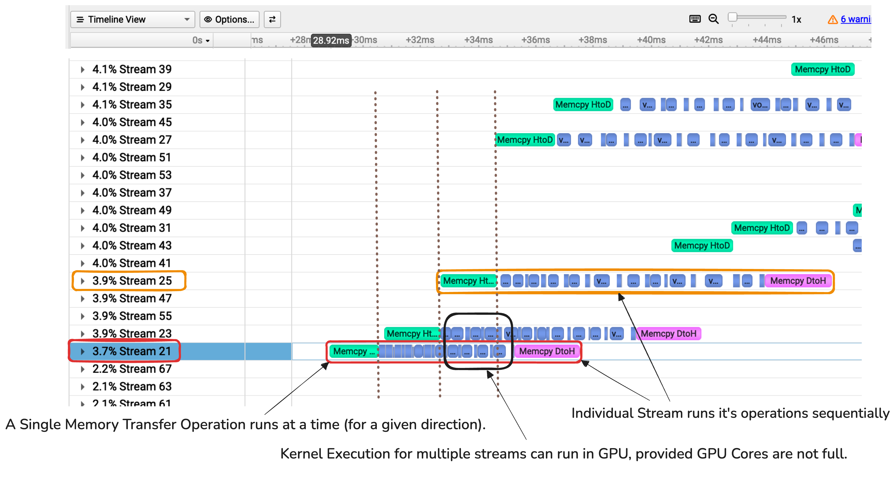

# CPU-GPU Interactions in PyTorch: Program Flow, Memory, and Asynchronicity

Profiling pytorch program is underrated. I share some notes after profiling pytorch programs with `nvidia nsight systems`, which should be useful to write/debug deep learning programs. Hope this article helps answer these questions : 


1. What does program flow looks like when we run say `python train.py`
2. How can we use `asynchronous operations` (discussed below) with `CUDA streams` and `pinned Tensors` to speed things up? What are the trade-offs we make ?
3. How exactly does data transfer happen ? How much time is spent on data-transfer vs. actual computation in the GPU  ? 
4. How does Memory management take place with Tensors on GPU side ?


To start, Deep learning programs have two kinds of data movement, which we aim to minimize :
1. Between Host Memory & Device/GPU Memory 
2. Between Processor (CPU/GPU) <-> that processor's Memory (at different hierarchies i.e Cache and Main Memory). 

I explore the first case. Second case is beautiful world of writing custom Kernel ( code that's designed to run in GPU ) that utilize GPU's Memory-Hierarchy better, improve cache-hits, Fusion Operations ( incorporate more compute per data load like with Flash Attention ) e.t.c which I plan to deep dive later.


## 1. Asynchronous Operations in PyTorch and CUDA Streams

By nature, several operations involving the GPU can be asynchronous, meaning the CPU can issue a command and immediately move on to the next task without waiting for the first one to finish. The three main asynchronous operations are:

1. Host-to-Device (H2D) Data Transfer (CPU → GPU)
2. Kernel Execution on the GPU
3. Device-to-Host (D2H) Data Transfer (GPU → CPU)

This parallelism is made possible by the Direct Memory Access (DMA) engine, which handles data transfers independently, freeing up the CPU and GPU to perform other tasks.

<!--  -->


<!-- As show in figure below, The DMA engine enables asynchronous data transfers between CPU and GPU. Both processors can work independently during transfers. -->


### A Mental Model for CUDA Streams
We can think of a CUDA stream as a queue on the GPU. The CPU adds tasks (like data transfers or kernel launches) to this queue.

- Operations within the same stream are executed sequentially, in the order they were added.

- Operations in different streams can run concurrently, allowing for powerful pipelining (Discussed below).

By default, all PyTorch CUDA operations happen in the single "default stream." Let's trace a simple program to see how this works.

```python
"""
1. CPU allocates tensor in host memory (RAM) .. (A BLOCKING Operation)
NOTE : `pin_memory` must be set True for this operation to be async. This memory remains strictly in "Physical RAM". More insights :  https://docs.pytorch.org/tutorials/intermediate/pinmem_nonblock.html
"""
A_gpu = torch.zeros((1024,1024), device="cpu", pin_memory=True)


"""
2. Similar to 1. Another CPU side operation
"""
B_gpu = torch.zeros((32,32), device="cpu", pin_memory=True)


"""
3. This call queues a Host-to-Device (H2D) memory copy for tensor A_gpu on the default stream. Code continues to next line. In parallel, the free DMA Engine independently collects task from Default Stream's Queue and starts the data transfer part .. (NON BLOCKING)
"""
A_gpu = A_gpu.to("cuda", non_blocking=True)

"""
4. CPU queues another task for data-transfer in the default stream queue.This task will stay in TASK QUEUE as DMA Engine is occupied with moving A_gpu. CPU then continues executing next instruction. (NON BLOCKING)
"""
B_gpu = B_gpu.to("cuda", non_blocking=True)


"""
5. CPU (Python Code) is blocked as Memory is being allocated in RAM .. (BLOCKING)
"""
C_gpu = torch.zeros((64,64), device="cpu")


"""
6. Even with `non_blocking` set to True, this call will block CPU for a while.
Since C_gpu is not `pinned` but a `paegable` memory ( default behavior when allocating Tensors), the copy happens in two stages. First, CUDA driver is involved in moving this whole data to another part of physical memory called "Pinned Memory buffer" temporarily. Then DMA transfer from the temporary buffer to the GPU is queued. And CPU is unblocked now.

### PERFORMANCE IMPLICATION :: 
- Pinning avoids dual copy and hence it's faster. 
- Copying "Pageable memory" like C_gpu is also more "memory-expensive". If If tensor to transfer is 1 GB, additional 1 GB buffer would have to be allocated in the Main Memory.
- However, in low-memory devices, Pinning severely effects whole system performance. Because it increases page-fault (and thus memory read/write latency) for all other programs in the machine.
"""
C_gpu = C_gpu.to("cuda", non_blocking=True)

# This insturction executes in CPU (Blocking )
cpu_work = [i**2 for i in range(100)]

 
"""

7. The CPU then proceeds to queue the matmul(A_gpu, A_gpu) and softmax(B_gpu) kernels in default stream.
"""
A_gpu = torch.matmul(A_gpu, A_gpu)
B_gpu = torch.softmax(B_gpu)


```

### Key Takeaway : 
ALL TASKS IN THE "SAME STREAM" RUN SEQUENTIALLY. In figure below (obtained from `minimal_profile_example.py`), after `A_gpu` transfer gets finished, and DMA initiates the `B_gpu` transfer as next task in the Queue. Even though GPU is free and `A_gpu` has been loaded into memory, GPU Core won't launch matmul-kernel to process `A_gpu` at that same time.



## 2. Leveraging CUDA Streams for Pipelining

Imagine we have many independent batches of data to process. Instead of waiting for one batch to complete its entire journey (H2D copy → Kernel → D2H copy), we can overlap these operations using multiple CUDA streams. As soon as the first batch is on the GPU and its kernel is running, we can start copying the second batch. This idea is called pipelining.

NOTE : For sake of brevity, we apply same computations to all our our inputs. One might ask, why don't you send whole thing as one big-batch ? Yeah I agree. Just imagine a scenario, that we had to apply different kernel  to these individual inputs, rather than the same `torch.matmul`.

Let's compare sequential (`sequential_data_processing.py`) vs streamed approach (`streamed_data_processing.py`):

### Sequential Processing
```python
def sequential_data_processing():
    for i in range(ITERS):
        # Whether we set non_blocking to `True` or `False`, won't
        # cuz we are launching CUDA API calls in the same stream.  
        A_gpu = input[i].to("cuda", non_blocking=False)
        C_gpu = torch.matmul(A_gpu, A_gpu)
        input[i].copy_(C_gpu, non_blocking=False)
```

### Streamed Processing
```python
# Here, we new stream is created for each iteration (each new input).
streams = [torch.cuda.Stream() for _ in range(ITERS)]
def streamed_data_processing():
    for i in range(ITERS):
        with torch.cuda.stream(streams[i]):
            A_gpu = input[i].to("cuda", non_blocking=True)
            C_gpu = torch.matmul(A_gpu, A_gpu)
            input[i].copy_(C_gpu, non_blocking=True)
```

## 3. Performance Analysis 

We use NVIDIA Nsight Systems to profile these two modes of processing :


<!--  -->
### 3.1 Sequential execution:
- We see the `GPU is waiting for Data most of the time.`
- Each operation run one after another.
- `292ms` total GPU time for overall processing.



## 3.2 Streamed execution
- `122ms` total GPU time for overall processing (2.4x faster)
- Operations from different streams overlap



### 3.3 Key Observations
1. Data transfers consume >50% of execution time ( even when using pinned memory.) Without pinning our memory, it would be even slower.
2. `Streamed Execution keeps GPU Busy !` Kernel executions from SEPARATE streams can run in parallel. i.e As long as the GPU's SM Core has enough resources, the task scheduler on GPU will run the individual `kernel-launch requests` (those matmuls) from different streams simultaneously. 
3. Host-to-Device and Device-to-Host data transfer for separate streams runs independently. But I didn't observe parallel Memory transfers across multiple streams in the same direction. ( Maybe it's dependent on hardware capabilities of DMA engine I don't know )

### 3.4 Additional Insights : 
#### Peak GPU Global Memory Usage :
In streamed execution, aside from sole benefit of pipelining, we noticed these kernel-launch instructions ran in parallel. What this implies is, independent read/writes are happening between GPU Processer and GPU Global Memory simultaneously. 

Eyeballing the max GPU memory usage (`watch -n 0.1 nvidia-smi`), I noticed the `Peak GPU Global Memory usage is 2 Gb Higher during streamed execution.`.

#### Peak CPU Host Memory Usage with Pinning
When we pin the memory significantly impacts peak memory usage. There are two approaches:

- Pin during allocation: `torch.randn(size, pin_memory=True)`
- Pin later on : `tensor.pin_memory()`

Pinning memory after tensor allocation uses approximately double the peak memory compared to pinning during allocation. This occurs because when you call .pin_memory() on an existing tensor, PyTorch must:

1. Allocate a new pinned memory buffer
2. Copy data from the original unpinned tensor to the new pinned buffer
3. Eventually deallocate the original tensor

During this process, both the original tensor and the new pinned tensor coexist in memory temporarily, resulting in nearly 2x memory overhead.


As discussed in our first example, Pinning improves data-transfer time at the cost of 
potentially disrupting system performance. Interestingly, it also consumes less RAM as it avoids additional copy to buffer as shown below.

From our benchmark program (`pinned_memory_ram_usage.py`):
```python
Peak Host-Memory usage on "4 Byte Tensor" (baseline)  : 2895.0 MiB
Peak Host-Memory usage on pinning "512 MB Tensor" in advance : 3410.0 MiB  (+515 MiB)
Peak Host-Memory usage on pinning  "512 MB Pageable Tensor" later : 3923.4 MiB  (+1028 MiB)
```

## Summary

1. CUDA streams can overlap independent data transfers and computations. This keeps GPU busy with useful work.
2. Data copies from different streams do not overlap, but kernel executions can, if resources allow.
3. Profile code to visualize bottlenecks .
4. Keep in mind the nuances of max host-memory usage when pinning
---

**References:**
- [PyTorch CUDA Streams Documentation](https://pytorch.org/docs/stable/notes/cuda.html#cuda-semantics)
- [PMPP - Pinned Memory and Streams](https://youtu.be/aNchuoFCgSs)
- [Pytorch Memory pining Tutorial](https://docs.pytorch.org/tutorials/intermediate/pinmem_nonblock.html)
- [NVIDIA Nsight Systems](https://docs.nvidia.com/nsight-systems/index.html)
